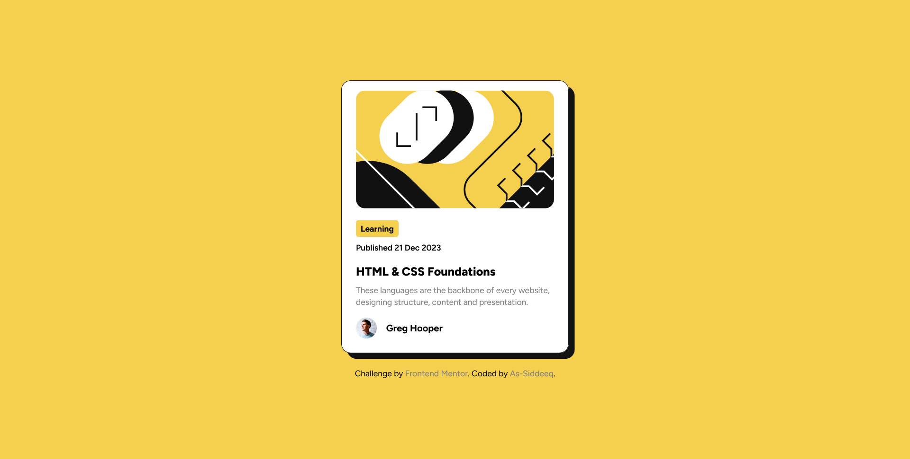

# Frontend Mentor - Blog preview card solution

This is a solution to the [Blog preview card challenge on Frontend Mentor](https://www.frontendmentor.io/challenges/blog-preview-card-ckPaj01IcS). Frontend Mentor challenges help you improve your coding skills by building realistic projects. 

## Table of contents

  - [The challenge](#the-challenge)
  - [Screenshot](#screenshot)
  - [Links](#links)
  - [Built with](#built-with)
  - [Useful resources](#useful-resources)
- [Author](#author)
- [Acknowledgments](#acknowledgments)

### The challenge

- Recreate the design
- style hover states for interactive element on the page

### Screenshot

### Links

- Solution URL: (https://github.com/A-Siddeeq/blog-preview-card-main)
- Live Site URL: (https://blog-preview-card-main-ten-chi.vercel.app/)

### Built with

- Tailwind CSS
- Mobile-first workflow

### Useful resource(s)

- [Tailwindcss official Documentation](https://tailwindcss.com/docs/installation) - This helped me for whenever i was confused. I really liked this pattern and will use it going forward.

## Author

- Frontend Mentor - [@A-Siddeeq](https://www.frontendmentor.io/profile/A-Siddeeq)

## Acknowledgments

Tailwind Docs, FrontendMentor -- for the challenge
